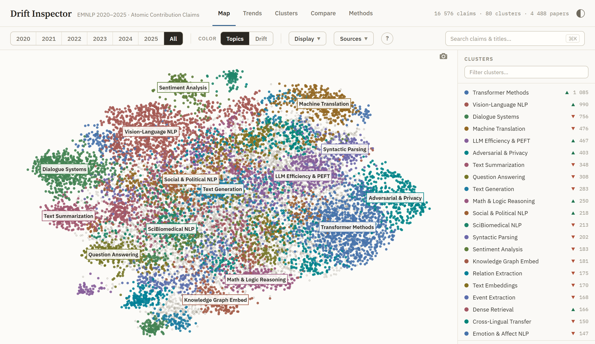
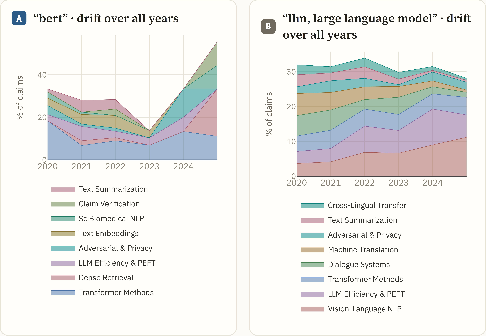

# Drift Inspector

**Exploring and measuring scientific drift with Atomic Contribution Claims.**

| | |
|---|---|
| 🌐 **Live demo** | https://hamyrappy.github.io/drift-inspector-acl/ — ACL, EMNLP, NAACL, EACL, COLING, AACL · 2018–2026 |
| 🔗 **Project page** | https://hamyrappy.github.io/drift-inspector/ |
| 🗺 **Paper case study** | https://hamyrappy.github.io/drift-inspector-emnlp/ — EMNLP 2020–2025 |
| 📄 **Paper** | EMNLP 2026 System Demonstrations (under review) |
| 🤗 **Datasets** | [full ACL Anthology](https://huggingface.co/datasets/Hamyrappy/acl-anthology-atomic-claims) — 346k claims, 423 venues · [EMNLP 2020–2025 + clusters](https://huggingface.co/datasets/Hamyrappy/emnlp-2020-2025-atomic-claims) |

Scientific abstracts mix contributions with background, motivation, and
meta-language, so tools that read abstracts as-is cannot separate what a field
*produces* from what it merely *discusses*. Drift Inspector measures how a
research field reorganizes itself at the level of **Atomic Contribution Claims
(ACCs)** — self-contained, contribution-bearing propositions that an LLM
extracts from each abstract before any analysis. Claims from all years are
embedded with SPECTER2, jointly reduced with UMAP and clustered with HDBSCAN,
and served as an interactive WebGL map with year replay, drift overlays,
full-text claim search, and side-by-side cohort comparison.



In the paper's EMNLP 2020–2025 case study: parsing loses 97% of its
document-frequency share; machine translation, dialogue, and question
answering each shrink by 3.7–4.4 percentage points; vision-language modeling
grows 3.1× and agents more than tenfold.

## Two instances, one pipeline

| Instance | Corpus | Size | Where |
|---|---|---|---|
| **Extended (main demo)** | ACL, EMNLP, NAACL, EACL, COLING, AACL main tracks, 2018–2026 | 15,457 papers · 69,950 claims · 88 clusters | [live](https://hamyrappy.github.io/drift-inspector-acl/) · [`inspector/`](inspector/) |
| **EMNLP (paper case study)** | EMNLP main track, 2020–2025, year-balanced sample (748 papers/year) | 4,488 papers · 16,576 claims · 80 clusters | [live](https://hamyrappy.github.io/drift-inspector-emnlp/) · [`inspector-emnlp/`](inspector-emnlp/) |

The extended instance is the one to explore — six venues in a single joint
claim space, with cross-venue comparison. The EMNLP instance is the
controlled corpus behind every number in the paper: one conference,
year-balanced, analysed in depth. Both are plain static HTML/CSS/JS.

## Explore without installing anything

Open the [live demo](https://hamyrappy.github.io/drift-inspector-acl/), or
grab [`drift_inspector_v5.html`](drift_inspector_v5.html) — a single-file
build of the extended instance (~18 MB; GitHub won't preview it, use the
*Download raw file* button) — and open it in any modern browser. Five views:

- **Map** — every claim as a point on the joint embedding, with year replay,
  drift overlay, and full-text claim search.
- **Trends** — butterfly chart of the fastest-growing / fastest-declining
  clusters, cluster trajectories, per-cluster sparklines.
- **Clusters** — per-cluster profile: LLM-generated name, c-TF-IDF descriptor,
  size history, representative claims with links to source papers.
- **Compare** — the thematic profiles of two cohorts (venue, author, keyword,
  or year range), as snapshots or over time.
- **Methods** — pipeline and corpus summary.



## Rebuild the demo from the shipped data

No API keys needed — extraction outputs and the canonical clustering ship in
this repository:

```bash
uv sync          # Python 3.12 env with the `acc` CLI (torch included — a few GB)
uv run acc all   # embed -> project -> build-inspector -> bake
uv run acc serve # preview at http://localhost:8000
```

This rebuilds the extended instance (`inspector/data/acc_data.json` + the
portable `drift_inspector_v5.html`). The first run downloads the SPECTER2
encoder and re-embeds the ~70k-claim corpus (about an hour on a laptop CPU;
cached afterwards); seeds are fixed and versions pinned in `uv.lock`, so the
build is reproducible — bit-identical on the same platform.

To re-derive the clustering itself rather than reuse the shipped
`data/clusters/acc_clusters.csv`, run `uv run acc cluster` first (it
recomputes the per-source embedding caches on first run; the UMAP + HDBSCAN
recipe lives in `src/acc/config.py`). The paper's EMNLP analysis is
reproduced by `notebooks/analysis.ipynb` from
`artifacts/baseline/acc_clusters_emnlp.csv`; `inspector-emnlp/` is a pinned
build of that corpus.

## The full pipeline from raw abstracts

| Stage | Command | Output |
|---|---|---|
| 1. Corpus download | `uv run acc download --venue emnlp --years 2020:2025` | `data/claims_sources/<id>/papers.csv` |
| 2. ACC extraction (LLM) | `uv run acc extract --source <id>` | `…/<id>/claims.csv` |
| 3. Extraction QA (LLM judge) | `uv run acc judge --source <id>` | judge report |
| 4. Claim embedding | `uv run acc embed` | cached SPECTER2 embeddings |
| 5. Joint clustering | `uv run acc cluster` | `data/clusters/acc_clusters.csv` |
| 6. Cluster names (LLM) | `uv run acc name` | `data/clusters/cluster_names.json` |
| 7. Site data + portable build | `uv run acc build-inspector` + `uv run acc bake` | `inspector/data/acc_data.json` + `drift_inspector_v5.html` |
| 8. Robustness grid (study corpus) | `uv run acc robustness` | `artifacts/robustness_grid.csv` |

The LLM stages (2, 3, 6) call an OpenAI-compatible endpoint: set
`OPENROUTER_API_KEY` in `.env` (the provider is picked automatically from the
configured key; `--provider` overrides, other endpoints can be added to
`PROVIDERS` in `src/acc/llm.py`). The paper's EMNLP corpus was extracted with
`qwen3-235b-a22b-thinking-2507`; the scaled corpora use `gpt-oss-120b`, which
preserves cluster validity and all 15 headline drift directions (§4.3 of the
paper). Everything downstream of extraction runs locally on CPU.

**Your own venue:** the pipeline is corpus-agnostic — anything with
`paper_id, year, title, abstract` works:

```bash
# prerequisite: the embedding/projection caches from `uv run acc all` above
uv run acc download --venue <venue> --years 2019:2026   # or drop a papers.csv into data/claims_sources/<id>/
uv run acc extract --source <id>                        # LLM claim extraction
uv run acc assign  --source <id>                        # nearest-centroid assignment to the joint clusters
uv run acc build-inspector && uv run acc bake           # fold it into the demo
```

Re-clustering *jointly* with a new venue additionally requires listing the
source id under `display` and `clustering` in
`data/claims_sources/manifest.json`, then `uv run acc cluster --reassemble`.

## Repository layout

```
inspector/               extended 6-venue instance — the main demo (/drift-inspector-acl/)
inspector-emnlp/         paper case-study instance (/drift-inspector-emnlp/)
landing/                 project landing page      (/drift-inspector/)
drift_inspector_v5.html  portable single-file build (extended corpus)
src/acc/                 pipeline package — the `acc` CLI
notebooks/               analysis, human validation, baseline comparison
data/                    claims, clusters, per-venue sources
artifacts/               released evaluation artifacts (see below)
```

## Data

Shipped in this repository:

- `data/clusters/acc_clusters.csv` + `cluster_names.json` — the canonical
  joint clustering of the extended corpus and its LLM-generated,
  author-reviewed cluster names.
- `data/claims_sources/` — per-venue `claims.csv` / `papers.csv` for the six
  clustering sources (registered in `manifest.json`) plus `emnlp_full`, the
  gpt-oss-120b re-extraction behind the extractor ablation.
- `artifacts/baseline/acc_clusters_emnlp.csv` — the paper's 16,576-claim
  case-study corpus with cluster assignments: the corpus behind every number
  in the paper.
- `data/claims/openrouter_claims.csv` — the raw EMNLP extraction output.

Distributed on Hugging Face (too large for git): the **full ACL Anthology ACC
dataset** — 346,010 claims from 80,144 abstracts across 423 venues
([acl-anthology-atomic-claims](https://huggingface.co/datasets/Hamyrappy/acl-anthology-atomic-claims)).
The EMNLP corpus is mirrored there as ready-to-load parquet with its cluster
assignments and per-cluster drift statistics
([emnlp-2020-2025-atomic-claims](https://huggingface.co/datasets/Hamyrappy/emnlp-2020-2025-atomic-claims)).

Not shipped: the third-party SToP taxonomy used by the notebooks (from the
ACL OCL corpus, Rohatgi et al., 2023; expected at
`data/external/STop_topic_classification_dataset_for_scientific_papers.csv`),
the raw EMNLP abstract dump (`data/raw/`) and the internal master sheet behind
the human-validation sheets, and regenerable embedding caches (`*.npy`).
Notebook cells that need an absent file skip themselves with a note; every
headline number reproduces from the shipped files.

## Evaluation artifacts

Everything the paper promises to release lives under `artifacts/`:

- **Baselines** — `baseline/full_comparison_table.tex`,
  `baseline/stop_alignment_table.csv`: ACC clustering vs LDA, NMF, BERTopic
  variants, and a sentence-level SPECTER2 baseline (intrinsic metrics and
  SToP-taxonomy alignment).
- **Human validation** — `human_validation/`: annotation protocol, three
  de-identified annotator sheets, and the LLM-judge run (180 items, Fleiss'
  κ = 0.844; the independent judge matches the 2-of-3 majority at 94.5% and
  flags 43/44 planted negatives).
- **Encoder ablation** — `audit/encoder_ablation_*.csv`: nine alternative
  representations; every one preserves ≥ 11 of 15 headline drift signs
  (median 14/15).
- **Extractor ablation** — `audit/extractor_ablation_*`: full re-extraction
  with gpt-oss-120b preserves all 15 headline signs.
- **Robustness** — `robustness_grid.csv`, `robustness/`: a 36-cell UMAP/HDBSCAN
  hyperparameter grid over the study corpus; ARI 0.79–0.95 against the
  reported clustering, and all 15 headline signs hold in all 36 cells.
  `uv run acc robustness` regenerates the grid from the shipped files
  (re-embeds the study corpus on first run).

Produced by the included notebooks — see [`notebooks/README.md`](notebooks/README.md).

## Licenses

- **Code:** [MIT](LICENSE)
- **Claim datasets and evaluation artifacts:** CC BY 4.0 — derived from ACL
  Anthology abstracts, which are themselves CC BY 4.0.

## Citation

```bibtex
@inproceedings{karimov2026driftinspector,
  title     = {Drift Inspector: Exploring and Measuring Scientific Drift
               with Atomic Contribution Claims},
  author    = {Karimov, Vsevolod and Ostarkov, Stepan and Poroshina, Anastasia
               and Frolov, Anatoly and Panchenko, Alexander},
  booktitle = {Proceedings of the 2026 Conference on Empirical Methods in
               Natural Language Processing: System Demonstrations},
  year      = {2026},
  note      = {Under review}
}
```
